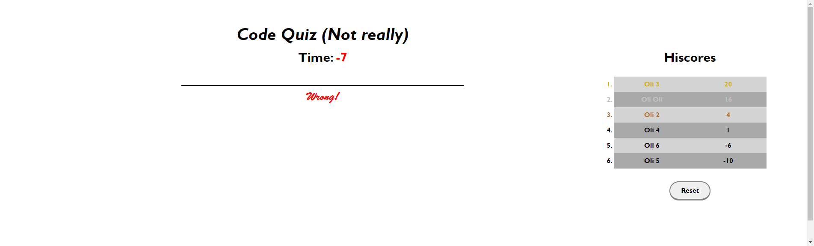

# Code-Quiz

## Description
This is a simple code quiz (questions are not really about coding, but oh well). When the user initiates the game, questions will be cycled through until question pool runs out or the timer reaches zero. Depending on how the user does, a score based on remaining time upon completion will be assigned, and the user can opt to post their performance on a hiscore chart.

## Features
A total of 5 questions can be attemped, none of which really about coding.

When the user presses the start button, the user will be asked if they want to play the easy mode, which gives 20 extra seconds.

After choosing the mode, the start button will disappear, and the first question will be shown.

Upon choosing one out of four options, the next question will be displayed along with a short colored message at the bottom telling the user if they answered the previous question correctly.

If the user happens to choose a wrong answer, 10 seconds will be deducted from the timer as penalty.

When timer drops below 10 seconds, the number will start to display in red.

The game ends when timer reaches zero, or the user exhausts the question pool. Either way, the remaining time will be the score.

The user will be prompted to enter their name. Should they choose to enter a non-empty string, their name along with their score will be shown on the hiscore ranking, which will automatically display users ordered by their scores.

The hiscore list is stored locally, so it is persistent when refreshing the page. The first place will be colored gold, the second place silver, and the third place bronze.

The user has a reset button which removes the stored data as well as the displayed ranking on the screen.

## Deployed Link
https://runescape11111.github.io/Code-Quiz/

## Screenshot of ongoing game and question

## Screenshot of finished game and hiscore
